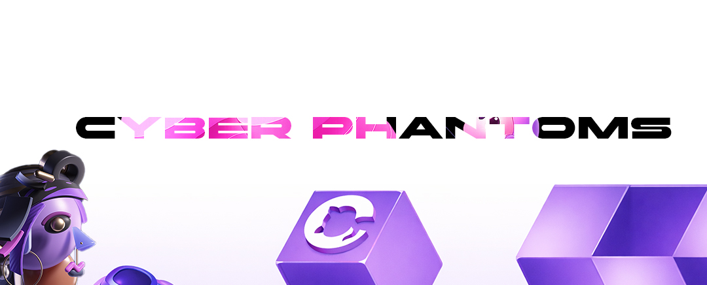

#Eyecode University #Task
👥 Студенты
<ul>
    <li>Student ID: #FD-240501-012 — Стас Чибисов </li>
    <li>Student ID: #FD-240501-011 — Михаил Ортлиб  </li>
</ul>

# 🧠 Задание: Навигация Desktop + Mobile для Next.js приложения

**Цель:**  
Реализовать навигацию для приложения на **Next.js + React** с двумя отдельными компонентами: **DesktopNav** и **MobileNav**, которые отображаются в зависимости от размера окна. Обе навигации должны использовать routing Next.js и корректно подсвечивать активную ссылку.[web:61][web:62][web:63][web:64][web:66][web:67][web:69][web:70]

---

## ✅ Требования к функционалу

### 1. Технологический стек

- **Next.js** (App Router или Pages Router — на выбор).
- **React**.
- Можно использовать любую CSS‑систему (CSS modules, Tailwind, styled-components и т.п.).[web:61][web:64][web:68]

---

### 2. Компоненты навигации

Необходимо создать **два отдельных компонента**:

- `DesktopNav` — навигация для десктопа.
- `MobileNav` — навигация для мобильных устройств (бургер‑меню/выезжающее меню).

Оба компонента должны:

- отображать один и тот же набор ссылок (например: Home, About, Blog, Contacts);  
- использовать `next/link` для переходов;  
- подсвечивать **активную ссылку** в зависимости от текущего маршрута (через `usePathname` из `next/navigation` или аналогичный подход).[web:66][web:67][web:69][web:70]

---

### 3. Отображение в зависимости от размера окна

- Вёрстка должна обеспечивать:
  - показ **DesktopNav** на больших экранах (например, ≥ 1024px),
  - показ **MobileNav** на маленьких экранах (например, < 1024px).
- Спрятать/показать компоненты можно:
  - либо через CSS (media queries),
  - либо через условную отрисовку с проверкой ширины окна (hook + state).  

Важно: в каждый момент времени пользователю показывается **только один** вариант навигации (desktop или mobile).

---

### 4. Routing и активная ссылка

- Навигация должна работать через встроенный роутинг Next.js:
  - минимум 3–4 страницы (например: `/`, `/about`, `/services`, `/contacts`).
- Активная ссылка должна:
  - визуально отличаться (цвет, подчёркивание, фон и т.п.);  
  - корректно определяться по текущему `pathname`.[web:66][web:67][web:69][web:70]

---

### 5. Требования к MobileNav

- Обязателен элемент **бургер‑меню** или иконка, по клику на которую:
  - открывается/закрывается список навигации.
- При клике на пункт меню:
  - происходит переход на страницу,
  - меню закрывается.[web:61][web:62][web:63]

---

## 📂 Рекомендуемая структура проекта

Пример (можно адаптировать под свой стиль):

```txt
src/
  app/ или pages/
    layout.(tsx|jsx)
    page.(tsx|jsx)
    about/
      page.(tsx|jsx)
    services/
      page.(tsx|jsx)
    contacts/
      page.(tsx|jsx)
  components/
    DesktopNav.(tsx|jsx)
    MobileNav.(tsx|jsx)
  styles/
    globals.css
    nav.css (или модули/Тailwind)
```

---

## 📤 Что сдавать

- Ссылка на **GitHub‑репозиторий** проекта.
- **README** с инструкцией:
  - как установить зависимости (`npm install` / `yarn install`),
  - как запустить проект (`npm run dev` / `yarn dev`).
- При проверке преподаватель должен:
  - видеть **DesktopNav** на десктопе и **MobileNav** на мобильной ширине,
  - переходить между страницами,
  - наблюдать корректную подсветку активной ссылки в обоих вариантах навигации.

<div align="center">
<div>📤 Сдача</div> 
<p>Отправить ссылку на репозиторий GitHub


